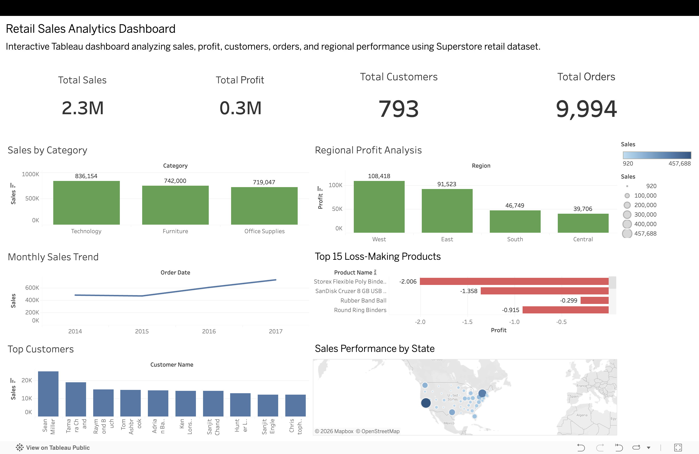

# 🛒 Retail Sales & Profit Analytics System

## 📌 Project Overview

This project analyzes retail sales data using Python, SQL, and Tableau to generate business insights related to:

- Sales Performance
- Profitability
- Customer Behavior
- Regional Analysis
- Shipping Performance
- Product Trends

The project demonstrates a complete data analytics workflow including data cleaning, exploratory analysis, SQL querying, visualization, and dashboard creation.

---

# 🚀 Features

✅ Data Cleaning & Preprocessing  
✅ Exploratory Data Analysis (EDA)  
✅ SQL-Based Business Queries  
✅ Customer & Profit Analysis  
✅ Monthly Sales Trend Analysis  
✅ Shipping Performance Analysis  
✅ Tableau Interactive Dashboard  
✅ Business Insights & Recommendations  

---

# 🧰 Tools & Technologies Used

| Tool | Purpose |
|------|----------|
| Python | Data Analysis |
| Pandas | Data Processing |
| Matplotlib | Visualization |
| SQL | Query Analysis |
| PostgreSQL | Database |
| Tableau Public | Interactive Dashboard |
| Jupyter Notebook | Analysis |
| VS Code | Development |

---

# 📂 Project Structure

```bash
ecommerce_analytics_project/
│
├── dashboard/
│   ├── retail_dashboard.png
│   ├── retail_dashboard_2.png
│   └── retail_dashboard.twbx
│
├── data/
│   ├── Sample - Superstore.csv
│   └── cleaned_superstore.csv
│
├── notebooks/
│   └── analysis.ipynb
│
├── reports/
│   ├── final_report.md
│   └── business_insights.txt
│
├── screenshots/
│   ├── sales_by_category.png
│   ├── monthly_sales_trend.png
│   ├── top_customers.png
│   └── loss_subcategories.png
│
├── sql/
│   └── analysis_queries.sql
│
├── requirements.txt
├── README.md
└── .gitignore
```

---

# 📊 Dashboard Preview

## Tableau Dashboard

The dashboard includes:

- KPI Cards
- Sales by Category
- Regional Profit Analysis
- Monthly Sales Trends
- Top Customers
- Loss-Making Products
- Geographic Sales Analysis

---
## 🔗 Live Tableau Dashboard

View Interactive Dashboard Here:

[Retail Sales Analytics Dashboard](https://public.tableau.com/views/RetailSalesAnalyticsDashboard_17784316093750/RetailSalesPerformanceDashboard?:language=en-GB&publish=yes&:sid=&:redirect=auth&:display_count=n&:origin=viz_share_link)

---

## 📸 Dashboard Screenshots

### Main Dashboard



### Additional Dashboard View


# 📈 Key Insights

- Technology category generated highest sales.
- Western region generated highest profit.
- Certain furniture products caused losses.
- Top customers contributed major revenue.
- Monthly sales showed upward growth trends.
- Shipping performance impacted customer experience.

---

# 💡 Business Recommendations

- Focus on profitable categories.
- Reduce discounts on loss-making products.
- Improve delivery efficiency.
- Build loyalty programs for top customers.
- Monitor regional performance regularly.

---

# 🗄 SQL Analysis

SQL queries were created for:

- Total Sales by Category
- Regional Profit Analysis
- Loss-Making Sub-Categories
- Top Customers
- Monthly Sales Trends
- Delivery Performance

---

# 📌 Dataset Used

Dataset:
Sample - Superstore Dataset

Records:
9994 rows

---

# ▶️ How to Run the Project

## 1. Clone Repository

```bash
git clone <repository-link>
```

## 2. Create Virtual Environment

```bash
python -m venv venv
```

## 3. Activate Environment

### Mac/Linux

```bash
source venv/bin/activate
```

### Windows

```bash
venv\Scripts\activate
```

## 4. Install Dependencies

```bash
pip install -r requirements.txt
```

## 5. Open Jupyter Notebook

```bash
jupyter notebook
```

---

# 📷 Visualizations Included

- Sales by Category
- Profit by Region
- Top Customers
- Monthly Sales Trend
- Loss-Making Sub-Categories

---

# 👨‍💻 Author

Shitanshu Jayprakash Chaurasiya

IIT Madras BS Degree Program

---

# 📜 License

This project is for educational and learning purposes.